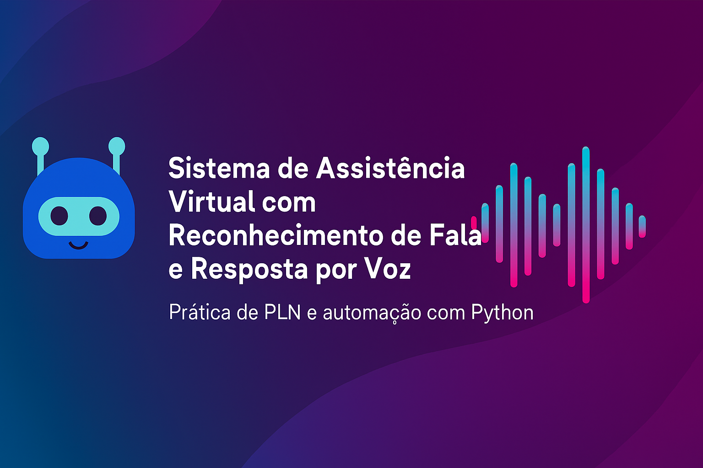

# Virtual-Voice-Assistant-Python-Project

# 🤖 Assistente de Voz Local — Projeto em Python  


## 🧠 Sistema de Assistência Virtual com Reconhecimento de Fala e Resposta por Voz  



---
## 🏅 Badges

- 📦 Tamanho do repositório:  
  

- 📄 Licença do projeto:  
  

---

Este projeto implementa um assistente virtual simples e funcional, capaz de ouvir comandos de voz pelo microfone, interpretar o que foi dito e responder com voz sintetizada. Ele também executa ações como abrir o YouTube, Wikipedia ou buscar farmácias próximas.  

This project implements a simple and functional virtual assistant capable of listening to voice commands through the microphone, interpreting what was said, and responding with synthesized speech. It also performs actions such as opening YouTube, Wikipedia, or searching for nearby pharmacies.

---

## 📋 Índice  
## 📋 Table of Contents

- [📖 Descrição / Description](#📖-descrição--description)  
- [⚙️ Funcionalidades / Features](#️-funcionalidades--features)  
- [🚀 Como Executar / How to Run](#🚀-como-executar--how-to-run)  
- [🧰 Tecnologias Utilizadas / Technologies Used](#🧰-tecnologias-utilizadas--technologies-used)  
- [👨‍💻 Autor / Author](#👨‍💻-autor--author)  
- [📜 Licença / License](#📜-licença--license)  
- [🏁 Conclusão / Conclusion](#🏁-conclusão--conclusion)

---

## 📖 Descrição / Description

**PT:**  
Este projeto foi desenvolvido como parte do curso da DIO e tem como objetivo aplicar técnicas de Processamento de Linguagem Natural (PLN) com foco em:

- 🎙️ Reconhecimento de fala (Speech to Text)  
- 🔊 Resposta por voz (Text to Speech)  
- 🧠 Interpretação de comandos simples  
- 🌐 Execução de ações via navegador

**EN:**  
This project was developed as part of the DIO course and aims to apply Natural Language Processing (NLP) techniques focused on:

- 🎙️ Speech recognition (Speech to Text)  
- 🔊 Voice response (Text to Speech)  
- 🧠 Simple command interpretation  
- 🌐 Action execution via browser

---

## ⚙️ Funcionalidades / Features

| 🧩 Função (PT)                  | 💡 Feature (EN)                        |
|--------------------------------|----------------------------------------|
| 🎙️ Captura de voz              | 🎙️ Voice capture                       |
| 🧠 Interpretação de comandos    | 🧠 Command interpretation               |
| 🔊 Resposta por voz             | 🔊 Voice response                       |
| 🌐 Ações automatizadas          | 🌐 Automated actions                    |

---

## 🚀 Como Executar / How to Run

### ✅ Pré-requisitos / Prerequisites

**PT:**  
Instale as bibliotecas necessárias com o pip:

```bash
pip install SpeechRecognition gTTS PyAudio
```
---

## 🌐 Acesso / Access

- [🔗 Repositório GitHub / GitHub Repository](https://github.com/Rogerio5/Virtual-Voice-Assistant-Python-Project)

---

▶️ Execução / Execution
PT:

Clone o repositório ou copie o código para um arquivo assistente.py

Execute com Python 3:

bash
python assistente.py
Fale um comando como:

“abrir YouTube lo-fi”

“Wikipedia inteligência artificial”

“farmácia perto de mim”

EN:

Clone the repository or copy the code into a file named assistente.py

Run with Python 3:

bash
python assistente.py
Speak a command such as:

“open YouTube lo-fi”

“Wikipedia artificial intelligence”

“pharmacy near me”

---

<h2>🧰 Tecnologias Utilizadas / Technologies Used</h2>

<p>
  
  
  
  
  

</p>

-
<br clear="all"/>

<ul>
  <li><strong>🐍 Python 3</strong></li>
  <li><strong>🎙️ SpeechRecognition</strong></li>
  <li><strong>🔊 gTTS (Google Text-to-Speech)</strong></li>
  <li><strong>🎧 PyAudio</strong></li>
  <li><strong>🌐 Webbrowser</strong> <em>(nativo do Python / native to Python)</em></li>
</ul>

---

## 👨‍💻 Desenvolvedor / Developer

- [Rogerio](https://github.com/Rogerio5)

---

## 📜 Licença / License

Este projeto está sob licença MIT. Para mais detalhes, veja o arquivo `LICENSE`.  
This project is under the MIT license. For more details, see the `LICENSE` file.

---

## 🏁 Conclusão / Conclusion

PT:
💬 Este assistente de voz local é uma aplicação prática de Processamento de Linguagem Natural (PLN) e automação com Python. Ele pode ser expandido com novos comandos, integração com APIs externas, ou até mesmo uma interface gráfica. Representa um excelente ponto de partida para projetos mais avançados de inteligência artificial conversacional, com potencial para evoluir em interfaces mais complexas, como chatbots inteligentes, agentes de suporte automatizados ou assistentes pessoais interativos.

EN: 
💬 This local voice assistant is a practical application of Natural Language Processing (NLP) and automation with Python. It can be expanded with new commands, integration with external APIs, or even a graphical interface. It represents an excellent starting point for more advanced conversational artificial intelligence projects, with the potential to evolve into more complex interfaces, such as intelligent chatbots, automated support agents, or interactive personal assistants.


